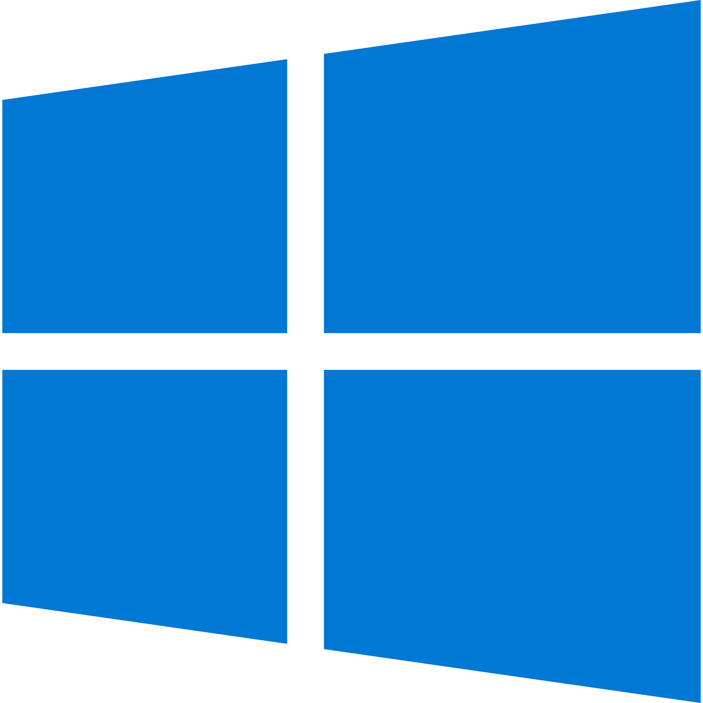

<h1>Heyyy ,  Myself Vivek</h1> 

I am a final year student of diploma in computer science and engineering at <b>Government Polytechnic College , Ranchi</b>.         
Just a  nerdy boy who likes to know more about <b>A.I </b>, <b> M.L </b> and <b>Web development</b>.
 <b> Mail : <a href="mailto: vivekthakurcse20509@gmail.com"> vivekthakurcse20509@gmail.com</a>
 <b> IG : <a href="https://www.instagram.com/vivekthakur.exe/">@vivekthakur.exe</b>

<h1>Languages & Skills</h1>

<h1>My Tools</h1>

  
  
 

